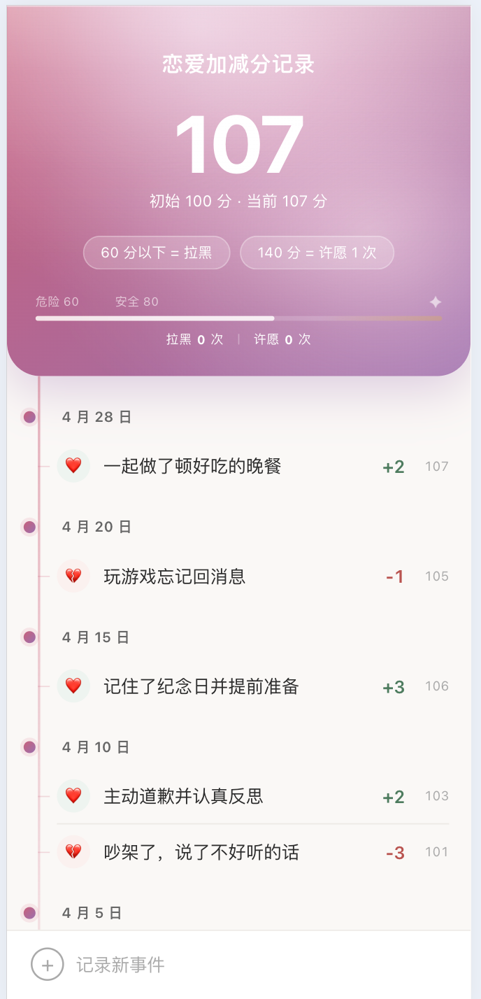
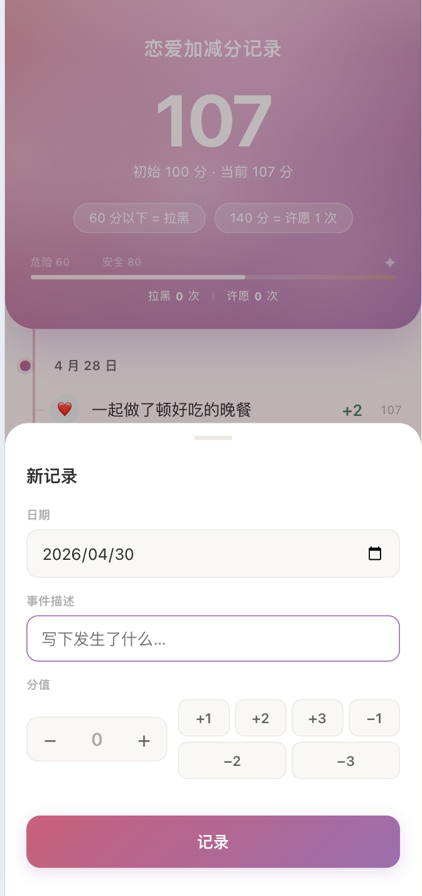
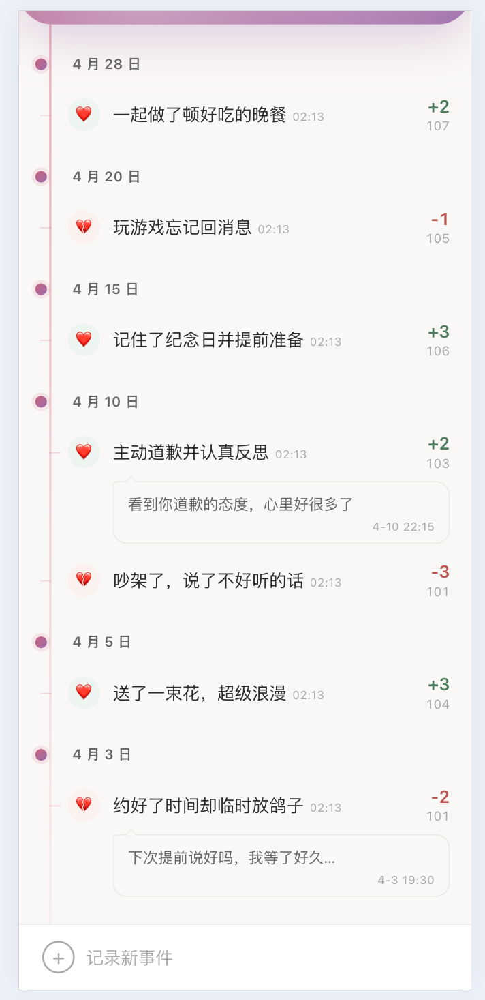

# 恋爱加减分记录

一款轻量的恋爱关系健康度追踪工具。通过记录日常事件的加减分，实时反映两人关系的状态走向。

初始分值 **100 分**，低于 60 分进入「拉黑」状态，达到 140 分可获得「许愿」机会。

## 截图

<table>
  <tr>
    <td align="center"><b>主界面</b></td>
    <td align="center"><b>记录新事件</b></td>
  </tr>
  <tr>
    <td></td>
    <td></td>
  </tr>
</table>

### 回复功能

每条评分记录支持回复一次，回复以气泡形式内嵌显示在记录下方，评分时间跟随描述文字行内展示。

<table>
  <tr>
    <td align="center"><b>回复气泡 · 行内时间</b></td>
  </tr>
  <tr>
    <td></td>
  </tr>
</table>

## 功能特性

- **实时分数看板** — 渐变色头部大字展示当前总分，进度条直观呈现分数区间
- **时间线记录** — 按日期分组，显示每条事件的描述、行内时间、分值变化与累计分
- **快速加减分** — 预设 ±1 / ±2 / ±3 按钮 + 步进器，操作流畅
- **回复记录** — 点击任意记录行即可回复一次，气泡内嵌展示，仅限一次
- **状态提醒** — 分数进入危险区（< 60）或达成许愿条件（≥ 140）自动弹出提示
- **拉黑 / 许愿计数** — 头部记录历史穿越次数，一眼掌握关系起伏
- **离线可用** — 内置示例数据，无需后端即可查看完整界面效果
- **数据导出** — 一键导出 JSON 备份文件

## 分数规则

| 分数区间 | 状态 |
|----------|------|
| ≥ 140 | 许愿机会达成 |
| 80 – 139 | 安全，表现良好 |
| 60 – 79 | 接近危险，需注意 |
| ≤ 60 | 已进入拉黑状态 |

## 技术栈

- **前端**：纯 HTML + CSS + JavaScript，零依赖，单文件可运行
- **后端**（可选）：PHP，`api.php` 提供 GET/POST 接口，数据存储为本地 `data.json`
- **部署**：可托管于任意静态服务器或 GitHub Pages（离线模式，示例数据展示）

## 快速开始

### 静态预览（无需服务器）

直接用浏览器打开 `index.html`，内置示例数据自动加载。

### 完整部署（需 PHP 环境）

```bash
# 将项目文件放到 PHP 服务器目录
# 确保 api.php 与 index.html 同级
# data.json 会在首次 POST 时自动创建
```

## License

MIT
